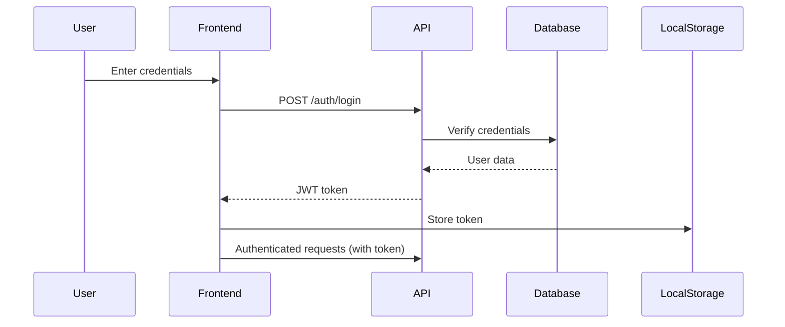

# Pizzeria da Gianni - Complete Project Documentation

## 📋 Table of Contents
1. [Project Overview](#project-overview)
2. [Technology Stack](#technology-stack)
3. [Database Architecture](#database-architecture)
4. [API Documentation](#api-documentation)
5. [Frontend Implementation](#frontend-implementation)
6. [Setup Instructions](#setup-instructions)
7. [Features](#features)
8. [Security Considerations](#security-considerations)
9. [Deployment Guide](#deployment-guide)
10. [Future Enhancements](#future-enhancements)

---

## 🎯 Project Overview

**Pizzeria da Gianni** is a comprehensive web application for a pizzeria restaurant that includes:
- Online menu browsing with real-time filtering
- Shopping cart and checkout system
- User authentication and profile management
- Table reservation system
- Delivery zone checker
- Review and rating system
- Admin dashboard for order management

### Project Goals
- Provide seamless online ordering experience
- Reduce phone orders and manual processing
- Increase customer engagement through reviews
- Streamline reservation management
- Enable delivery tracking in real-time

---

## 💻 Technology Stack

### Frontend
- **HTML5**: Semantic markup
- **CSS3**: Modern styling with CSS Grid and Flexbox
- **JavaScript ES6+**: Vanilla JS with modern features
- **Fonts**: Google Fonts (Playfair Display, Poppins)

### Backend (Recommended)
- **Node.js**: Runtime environment
- **Express.js**: Web framework
- **JWT**: Authentication tokens
- **bcrypt**: Password hashing

### Database
- **MySQL 8.0+**: Relational database
- **Views**: For optimized queries
- **Stored Procedures**: Business logic
- **Triggers**: Data consistency

### DevOps
- **Git**: Version control
- **Docker**: Containerization
- **Nginx**: Reverse proxy
- **PM2**: Process management
- **SSL/TLS**: HTTPS encryption

---

## 🗄️ Database Architecture

### Schema Overview

The database consists of **18 main tables** organized into logical groups:

#### User Management
- `users`: Customer accounts
- `addresses`: Delivery addresses
- `staff`: Restaurant employees

#### Product Catalog
- `categories`: Menu categories
- `products`: Menu items
- `product_sizes`: Size variations
- `ingredients`: Available ingredients
- `product_ingredients`: Default ingredients per product

#### Order Processing
- `orders`: Customer orders
- `order_items`: Items in each order
- `order_item_customizations`: Custom ingredients per item
- `cart`: Shopping cart
- `cart_customizations`: Cart item modifications

#### Reviews & Ratings
- `reviews`: Product reviews

#### Promotions
- `promo_codes`: Discount codes

#### Reservations
- `reservations`: Table bookings

#### Operations
- `delivery_zones`: Delivery coverage areas
- `opening_hours`: Restaurant schedule
- `notifications`: User notifications

### Key Relationships

```
users (1) ─────── (N) addresses
users (1) ─────── (N) orders
users (1) ─────── (N) reviews
users (1) ─────── (N) cart
users (1) ─────── (N) reservations

categories (1) ── (N) products
products (1) ───── (N) product_sizes
products (1) ───── (N) product_ingredients
products (1) ───── (N) reviews

orders (1) ────── (N) order_items
order_items (1) ─ (N) order_item_customizations

cart (1) ──────── (N) cart_customizations
```

### Database Views

**view_products_full**
- Complete product information with ratings
- Optimized for menu display
- Includes category and review aggregates

**view_orders_summary**
- Order overview with customer info
- Item counts and totals
- Used in admin dashboard

### Stored Procedures

**sp_calculate_order_total**
```sql
CALL sp_calculate_order_total(123);
```
Calculates subtotal, tax, delivery fee, and total for an order.

**sp_apply_promo_code**
```sql
CALL sp_apply_promo_code(123, 'BENVENUTO10', @discount, @success, @message);
```
Validates and applies promo codes to orders.

### Sample Data

The schema includes sample data for:
- 7 menu categories
- 10 pizza products with variations
- 15 ingredients
- 3 promo codes
- 4 delivery zones
- Complete opening hours schedule

---

## 🔌 API Documentation

### Base Configuration
```
Base URL: http://localhost:3000/api/v1
Authentication: Bearer Token (JWT)
Content-Type: application/json
```

### Endpoint Categories

#### 1. Authentication (`/auth`)
- `POST /auth/register` - Register new user
- `POST /auth/login` - User login
- `POST /auth/logout` - User logout

#### 2. Products (`/products`)
- `GET /products` - List all products with filters
- `GET /products/:id` - Get product details
- `GET /categories` - List categories

#### 3. Cart (`/cart`)
- `GET /cart` - Get user's cart
- `POST /cart` - Add item to cart
- `PUT /cart/:id` - Update cart item
- `DELETE /cart/:id` - Remove cart item
- `DELETE /cart` - Clear cart

#### 4. Orders (`/orders`)
- `POST /orders` - Create order from cart
- `GET /orders` - Get order history
- `GET /orders/:id` - Get order details
- `POST /orders/:id/cancel` - Cancel order

#### 5. Reviews (`/reviews`)
- `POST /reviews` - Submit review
- `GET /products/:id/reviews` - Get product reviews

#### 6. Reservations (`/reservations`)
- `POST /reservations` - Create reservation
- `GET /reservations` - Get user reservations
- `DELETE /reservations/:id` - Cancel reservation

#### 7. Addresses (`/addresses`)
- `GET /addresses` - List user addresses
- `POST /addresses` - Add new address
- `PUT /addresses/:id` - Update address
- `DELETE /addresses/:id` - Delete address

#### 8. Delivery Zones (`/delivery-zones`)
- `GET /delivery-zones/check?postal_code=37100` - Check delivery availability

#### 9. Restaurant Info (`/info`)
- `GET /info/opening-hours` - Get opening hours
- `GET /info/contact` - Get contact information

### Authentication Flow



### Error Handling

All endpoints return consistent error responses:
```json
{
  "success": false,
  "error": {
    "code": "ERROR_CODE",
    "message": "Human-readable message",
    "details": {}
  }
}
```

### Rate Limiting
- Anonymous: 100 requests per 15 minutes
- Authenticated: 1000 requests per 15 minutes

---

## 🎨 Frontend Implementation

### File Structure
```
pizzeria-mockup/
├── index.html          # Main HTML file
├── styles.css          # Complete stylesheet
└── app.js              # JavaScript application logic
```

### CSS Architecture

#### CSS Variables
All colors, spacing, and typography defined as CSS custom properties:
```css
:root {
  --primary-color: #e67e22;
  --primary-dark: #d35400;
  --spacing-xl: 3rem;
  --font-heading: 'Playfair Display', serif;
  ...
}
```

#### Component Structure
- **Navigation**: Fixed navbar with cart and user menu
- **Hero Section**: Full-screen landing with parallax
- **Menu Grid**: Responsive product cards with filtering
- **Modals**: Cart, product detail, and user authentication
- **Forms**: Reservation and contact forms
- **Footer**: Multi-column layout with newsletter

#### Responsive Breakpoints
```css
/* Tablet */
@media (max-width: 1024px) { ... }

/* Mobile */
@media (max-width: 768px) { ... }

/* Small Mobile */
@media (max-width: 480px) { ... }
```

### JavaScript Architecture

#### State Management
```javascript
const AppState = {
  user: null,
  cart: [],
  products: [],
  categories: [],
  currentCategory: 'all',
  isLoading: false
};
```

#### Class-Based Organization

**AuthManager**
- Token management (localStorage)
- Login/logout/register
- Authentication state

**APIService**
- HTTP request wrapper
- Token injection
- Error handling

**CartManager**
- Add/remove/update items
- Cart persistence (localStorage for guests)
- Cart UI updates

**ProductManager**
- Product loading and filtering
- Product modal
- Quick add to cart

#### Event Handling
- Smooth scrolling navigation
- Form submissions with validation
- Dynamic modal management
- Real-time cart updates

### UI Components

#### Menu Card
```html
<div class="menu-card">
  <div class="menu-card-image">
    
    <div class="menu-card-badges">
      <!-- Vegetarian, Spicy, Popular badges -->
    </div>
  </div>
  <div class="menu-card-content">
    <!-- Title, description, price, rating -->
  </div>
</div>
```

#### Cart Modal
- Displays cart items with quantity controls
- Shows subtotal, delivery fee, tax, and total
- Promo code input
- Checkout button

#### Product Detail Modal
- Large product image
- Detailed description
- Size selection
- Ingredient customization
- Add to cart

---

## ⚙️ Setup Instructions

### Prerequisites
- Node.js 16+
- MySQL 8.0+
- Git
- npm or yarn

### Database Setup

1. **Install MySQL**
```bash
# Ubuntu/Debian
sudo apt install mysql-server

# macOS
brew install mysql
```

2. **Create Database**
```bash
mysql -u root -p < database_schema.sql
```

3. **Verify Installation**
```sql
USE pizzeria_gianni;
SHOW TABLES;
SELECT * FROM products;
```

### Backend Setup

1. **Create Project**
```bash
mkdir pizzeria-backend
cd pizzeria-backend
npm init -y
```

2. **Install Dependencies**
```bash
npm install express mysql2 bcrypt jsonwebtoken cors dotenv
npm install --save-dev nodemon
```

3. **Create `.env` File**
```env
PORT=3000
DB_HOST=localhost
DB_USER=root
DB_PASSWORD=your_password
DB_NAME=pizzeria_gianni
JWT_SECRET=your_jwt_secret_key_here
JWT_EXPIRE=7d
NODE_ENV=development
```

4. **Create Basic Server** (`server.js`)
```javascript
const express = require('express');
const cors = require('cors');
require('dotenv').config();

const app = express();

app.use(cors());
app.use(express.json());

// Import routes
const authRoutes = require('./routes/auth');
const productRoutes = require('./routes/products');
const cartRoutes = require('./routes/cart');
const orderRoutes = require('./routes/orders');

// Use routes
app.use('/api/v1/auth', authRoutes);
app.use('/api/v1/products', productRoutes);
app.use('/api/v1/cart', cartRoutes);
app.use('/api/v1/orders', orderRoutes);

const PORT = process.env.PORT || 3000;
app.listen(PORT, () => {
  console.log(`Server running on port ${PORT}`);
});
```

5. **Start Server**
```bash
npm run dev  # with nodemon
# or
npm start
```

### Frontend Setup

1. **Copy Files**
```bash
cp -r pizzeria-mockup /var/www/html/
```

2. **Configure API Endpoint**
Edit `app.js`:
```javascript
const API_BASE_URL = 'http://your-api-domain.com/api/v1';
```

3. **Serve with HTTP Server**
```bash
# Using http-server (npm install -g http-server)
cd pizzeria-mockup
http-server -p 8080

# Or use Python
python3 -m http.server 8080
```

4. **Access Application**
```
http://localhost:8080
```

---

## ✨ Features

### Customer Features

#### 1. **Menu Browsing**
- Grid layout with high-quality images
- Category filtering (Classiche, Speciali, Bianche, Vegetariane)
- Search functionality
- Product badges (Vegetarian, Spicy, Popular)
- Rating and review display

#### 2. **Product Details**
- Large product image
- Full description
- Size selection with pricing
- Ingredient list
- Customer reviews
- Nutritional information

#### 3. **Shopping Cart**
- Real-time cart updates
- Quantity adjustment
- Remove items
- Price calculations
- Promo code application
- Guest and authenticated carts

#### 4. **User Authentication**
- Secure registration
- Email/password login
- Password reset (to be implemented)
- Profile management
- Order history

#### 5. **Checkout Process**
- Address selection/creation
- Delivery vs. pickup options
- Payment method selection
- Order summary with breakdown
- Estimated delivery time

#### 6. **Table Reservations**
- Date and time selection
- Party size
- Special requests
- Confirmation notifications

#### 7. **Delivery Zone Checker**
- Postal code validation
- Delivery fee display
- Estimated delivery time
- Minimum order requirements

#### 8. **Reviews & Ratings**
- 5-star rating system
- Written reviews
- Photo uploads (to be implemented)
- Review moderation

### Admin Features (To Be Implemented)

#### 1. **Order Management**
- View all orders
- Update order status
- Print receipts
- Refund processing

#### 2. **Product Management**
- Add/edit/delete products
- Manage categories
- Ingredient management
- Pricing updates

#### 3. **User Management**
- View customer accounts
- Order history per customer
- Ban/suspend users

#### 4. **Reservation Management**
- View all reservations
- Confirm/reject reservations
- Table assignment
- Customer notes

#### 5. **Analytics Dashboard**
- Sales reports
- Popular products
- Customer insights
- Revenue tracking

#### 6. **Promo Code Management**
- Create/edit promo codes
- Usage tracking
- Expiration management

---

## 🔒 Security Considerations

### Authentication & Authorization

1. **Password Security**
```javascript
const bcrypt = require('bcrypt');
const saltRounds = 10;

// Hashing
const hash = await bcrypt.hash(password, saltRounds);

// Verification
const match = await bcrypt.compare(password, hash);
```

2. **JWT Implementation**
```javascript
const jwt = require('jsonwebtoken');

// Generate token
const token = jwt.sign(
  { user_id: user.id, email: user.email },
  process.env.JWT_SECRET,
  { expiresIn: '7d' }
);

// Verify token
const decoded = jwt.verify(token, process.env.JWT_SECRET);
```

3. **Middleware Protection**
```javascript
const authMiddleware = (req, res, next) => {
  const token = req.headers.authorization?.split(' ')[1];

  if (!token) {
    return res.status(401).json({ error: 'Unauthorized' });
  }

  try {
    const decoded = jwt.verify(token, process.env.JWT_SECRET);
    req.user = decoded;
    next();
  } catch (error) {
    return res.status(401).json({ error: 'Invalid token' });
  }
};
```

### Input Validation

```javascript
const { body, validationResult } = require('express-validator');

// Validation rules
const registerValidation = [
  body('email').isEmail().normalizeEmail(),
  body('password').isLength({ min: 8 }).matches(/^(?=.*\d)(?=.*[a-z])(?=.*[A-Z])/),
  body('first_name').trim().isLength({ min: 2 }).escape(),
  body('phone').matches(/^\+?[1-9]\d{1,14}$/)
];

// Check validation
const errors = validationResult(req);
if (!errors.isEmpty()) {
  return res.status(400).json({ errors: errors.array() });
}
```

### SQL Injection Prevention

```javascript
// Use parameterized queries
const [results] = await db.execute(
  'SELECT * FROM users WHERE email = ?',
  [email]
);

// NEVER do this:
// const query = `SELECT * FROM users WHERE email = '${email}'`;
```

### XSS Prevention

```javascript
// Sanitize HTML input
const sanitizeHtml = require('sanitize-html');

const clean = sanitizeHtml(userInput, {
  allowedTags: [],
  allowedAttributes: {}
});
```

### CSRF Protection

```javascript
const csrf = require('csurf');
const csrfProtection = csrf({ cookie: true });

app.post('/api/orders', csrfProtection, (req, res) => {
  // Protected endpoint
});
```

### Rate Limiting

```javascript
const rateLimit = require('express-rate-limit');

const limiter = rateLimit({
  windowMs: 15 * 60 * 1000, // 15 minutes
  max: 100, // limit each IP to 100 requests per windowMs
  message: 'Too many requests'
});

app.use('/api/', limiter);
```

### HTTPS & Security Headers

```javascript
const helmet = require('helmet');
app.use(helmet());

// Force HTTPS
app.use((req, res, next) => {
  if (req.header('x-forwarded-proto') !== 'https') {
    res.redirect(`https://${req.header('host')}${req.url}`);
  } else {
    next();
  }
});
```

---

## 🚀 Deployment Guide

### Option 1: Traditional VPS (Ubuntu 22.04)

#### 1. Initial Server Setup
```bash
# Update system
sudo apt update && sudo apt upgrade -y

# Install Node.js
curl -fsSL https://deb.nodesource.com/setup_18.x | sudo -E bash -
sudo apt install -y nodejs

# Install MySQL
sudo apt install mysql-server -y
sudo mysql_secure_installation

# Install Nginx
sudo apt install nginx -y

# Install PM2
sudo npm install -g pm2
```

#### 2. Deploy Application
```bash
# Clone repository
git clone https://github.com/your-repo/pizzeria-gianni.git
cd pizzeria-gianni

# Install dependencies
npm install --production

# Setup environment
cp .env.example .env
nano .env  # Edit configuration

# Import database
mysql -u root -p < database_schema.sql

# Start with PM2
pm2 start server.js --name pizzeria-api
pm2 startup
pm2 save
```

#### 3. Configure Nginx
```nginx
# /etc/nginx/sites-available/pizzeria
server {
    listen 80;
    server_name pizzeriadagianni.it www.pizzeriadagianni.it;

    # Frontend
    root /var/www/pizzeria-frontend;
    index index.html;

    location / {
        try_files $uri $uri/ /index.html;
    }

    # API Proxy
    location /api/ {
        proxy_pass http://localhost:3000/api/;
        proxy_http_version 1.1;
        proxy_set_header Upgrade $http_upgrade;
        proxy_set_header Connection 'upgrade';
        proxy_set_header Host $host;
        proxy_cache_bypass $http_upgrade;
    }
}
```

```bash
# Enable site
sudo ln -s /etc/nginx/sites-available/pizzeria /etc/nginx/sites-enabled/
sudo nginx -t
sudo systemctl restart nginx
```

#### 4. SSL Certificate (Let's Encrypt)
```bash
sudo apt install certbot python3-certbot-nginx -y
sudo certbot --nginx -d pizzeriadagianni.it -d www.pizzeriadagianni.it
```

### Option 2: Docker Deployment

#### 1. Create Dockerfile
```dockerfile
# Backend Dockerfile
FROM node:18-alpine

WORKDIR /app

COPY package*.json ./
RUN npm ci --only=production

COPY . .

EXPOSE 3000

CMD ["node", "server.js"]
```

#### 2. Create docker-compose.yml
```yaml
version: '3.8'

services:
  db:
    image: mysql:8.0
    environment:
      MYSQL_ROOT_PASSWORD: ${DB_ROOT_PASSWORD}
      MYSQL_DATABASE: pizzeria_gianni
    volumes:
      - mysql_data:/var/lib/mysql
      - ./database_schema.sql:/docker-entrypoint-initdb.d/schema.sql
    ports:
      - "3306:3306"

  api:
    build: ./backend
    environment:
      - DB_HOST=db
      - DB_USER=root
      - DB_PASSWORD=${DB_ROOT_PASSWORD}
      - DB_NAME=pizzeria_gianni
      - JWT_SECRET=${JWT_SECRET}
    ports:
      - "3000:3000"
    depends_on:
      - db

  frontend:
    image: nginx:alpine
    volumes:
      - ./pizzeria-mockup:/usr/share/nginx/html
      - ./nginx.conf:/etc/nginx/conf.d/default.conf
    ports:
      - "80:80"
    depends_on:
      - api

volumes:
  mysql_data:
```

#### 3. Deploy with Docker
```bash
docker-compose up -d
docker-compose logs -f
```

### Option 3: Cloud Platforms

#### Heroku
```bash
# Install Heroku CLI
npm install -g heroku

# Login and create app
heroku login
heroku create pizzeria-gianni-api

# Add MySQL addon
heroku addons:create jawsdb:kitefin

# Deploy
git push heroku main

# Import database
heroku run mysql -h <host> -u <user> -p < database_schema.sql
```

#### AWS (EC2 + RDS)
1. Create RDS MySQL instance
2. Launch EC2 instance (Ubuntu 22.04)
3. Follow VPS deployment steps
4. Configure security groups
5. Setup Route 53 for DNS
6. Use ALB for load balancing

#### Vercel (Frontend only)
```bash
npm install -g vercel
cd pizzeria-mockup
vercel --prod
```

---

## 🔮 Future Enhancements

### Phase 1: Core Improvements
- [ ] Real-time order tracking with WebSockets
- [ ] Push notifications for order updates
- [ ] Mobile app (React Native)
- [ ] Progressive Web App (PWA) support
- [ ] Multi-language support (i18n)

### Phase 2: Advanced Features
- [ ] Loyalty program with points
- [ ] Gift cards and vouchers
- [ ] Subscription meal plans
- [ ] Catering orders for events
- [ ] Table QR code ordering (dine-in)

### Phase 3: Business Intelligence
- [ ] Advanced analytics dashboard
- [ ] Customer behavior tracking
- [ ] Inventory management integration
- [ ] Automated reordering system
- [ ] Marketing automation (email campaigns)

### Phase 4: Integration
- [ ] Payment gateways (Stripe, PayPal, Satispay)
- [ ] SMS notifications (Twilio)
- [ ] Email service (SendGrid)
- [ ] Social media login (OAuth)
- [ ] Google Maps integration
- [ ] POS system integration

### Phase 5: AI & Automation
- [ ] Chatbot for customer support
- [ ] Recommendation engine
- [ ] Dynamic pricing optimization
- [ ] Demand forecasting
- [ ] Automated inventory alerts

---

## 📊 Performance Optimization

### Frontend Optimization
- Image lazy loading
- Code splitting
- Minification and compression
- CDN for static assets
- Service worker caching

### Backend Optimization
- Database indexing
- Query optimization
- Redis caching layer
- Connection pooling
- Horizontal scaling

### Database Optimization
```sql
-- Add composite indexes
CREATE INDEX idx_orders_user_status ON orders(user_id, order_status);
CREATE INDEX idx_products_category_available ON products(category_id, is_available);

-- Optimize queries
EXPLAIN SELECT * FROM view_products_full WHERE category_id = 1;
```

---

## 🧪 Testing

### Unit Tests
```javascript
const request = require('supertest');
const app = require('../server');

describe('Auth API', () => {
  test('POST /auth/register creates new user', async () => {
    const res = await request(app)
      .post('/api/v1/auth/register')
      .send({
        email: 'test@example.com',
        password: 'Test123!',
        first_name: 'Test',
        last_name: 'User'
      });

    expect(res.statusCode).toBe(201);
    expect(res.body.data).toHaveProperty('token');
  });
});
```

### Integration Tests
- API endpoint testing
- Database transaction testing
- Authentication flow testing

### E2E Tests (Cypress)
```javascript
describe('Order Flow', () => {
  it('completes full order', () => {
    cy.visit('/');
    cy.get('.menu-card').first().click();
    cy.get('.menu-card-add').click();
    cy.get('.cart-btn').click();
    cy.get('.btn-checkout').click();
    // ... continue flow
  });
});
```

---

## 📝 License & Credits

**Project**: Pizzeria da Gianni
**Created by**: Terry - Terragon Labs
**Original Site by**: Popovschi Florin Antonio
**Institution**: ITIS MARCONI VERONA

This is a demonstration project for educational purposes.

---

## 📞 Support & Contact

For questions or support:
- **Technical Documentation**: See `API_DOCUMENTATION.md`
- **Database Schema**: See `database_schema.sql`
- **GitHub Issues**: [Create an issue](https://github.com/your-repo/issues)

---

**Last Updated**: October 31, 2025
**Version**: 1.0.0
